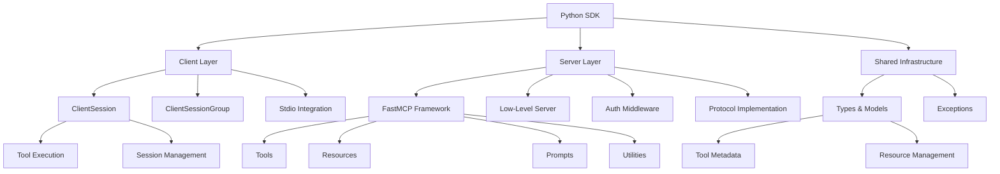

# Python SDK - Model Context Protocol

**Repository**: https://github.com/modelcontextprotocol/python-sdk
**Documentation**: https://modelcontextprotocol.io

## Project Architecture

This is an implementation of the **Model Context Protocol (MCP)** - a standard protocol that enables applications to provide contextual data to LLMs through a unified interface.



## Core Development Rules

## Module Index

### Client Layer (`src/mcp/client/`)
- **ClientSession**: Main client interface for tool execution and session management
- **ClientSessionGroup**: Manages multiple client sessions
- **Stdio Integration**: Provides standard I/O based server integration

### Server Layer (`src/mcp/server/`)
- **FastMCP Framework**: High-level framework with decorator-based tool definitions
- **Low-Level Server**: Core protocol implementation
- **Auth Middleware**: Authentication and authorization handlers
- **Protocol Implementation**: MCP standard implementation

### Shared Infrastructure (`src/mcp/shared/`)
- **Types & Models**: Protocol message types and data models
- **Exceptions**: Error classes and exception hierarchy

### Command Line Interface (`src/mcp/cli/`)
- **Operating System**: Platform-specific implementations

## Core Development Rules

1. Package Management
   - ONLY use uv, NEVER pip
   - Installation: `uv add package`
- Running tools: `uv run tool`
- Upgrading: `uv add --dev package --upgrade-package package`

- For commits fixing bugs or adding features based on user reports add:

  ```bash
  git commit --trailer "Reported-by:<name>"
  ```

  Where `<name>` is the name of the user.

- For commits related to a Github issue, add

  ```bash
  git commit --trailer "Github-Issue:#<number>"
  ```

- NEVER ever mention a `co-authored-by` or similar aspects. In particular, never
  mention the tool used to create the commit message or PR.

## Pull Requests

- Create a detailed message of what changed. Focus on the high level description of
  the problem it tries to solve, and how it is solved. Don't go into the specifics of the
  code unless it adds clarity.

- NEVER ever mention a `co-authored-by` or similar aspects. In particular, never
  mention the tool used to create the commit message or PR.

## Python Tools

## Code Formatting

1. Ruff
   - Format: `uv run --frozen ruff format .`
   - Check: `uv run --frozen ruff check .`
   - Fix: `uv run --frozen ruff check . --fix`
   - Critical issues:
     - Line length (88 chars)
     - Import sorting (I001)
     - Unused imports
   - Line wrapping:
     - Strings: use parentheses
     - Function calls: multi-line with proper indent
     - Imports: split into multiple lines

2. Type Checking
   - Tool: `uv run --frozen pyright`
   - Requirements:
     - Explicit None checks for Optional
     - Type narrowing for strings
     - Version warnings can be ignored if checks pass

3. Pre-commit
   - Config: `.pre-commit-config.yaml`
   - Runs: on git commit
   - Tools: Prettier (YAML/JSON), Ruff (Python)
   - Ruff updates:
     - Check PyPI versions
     - Update config rev
     - Commit config first

## Error Resolution

1. CI Failures
   - Fix order:
     1. Formatting
     2. Type errors
     3. Linting
   - Type errors:
     - Get full line context
     - Check Optional types
     - Add type narrowing
     - Verify function signatures

2. Common Issues
   - Line length:
     - Break strings with parentheses
     - Multi-line function calls
     - Split imports
   - Types:
     - Add None checks
     - Narrow string types
     - Match existing patterns
   - Pytest:
     - If the tests aren't finding the anyio pytest mark, try adding PYTEST_DISABLE_PLUGIN_AUTOLOAD=""
       to the start of the pytest run command eg:
       `PYTEST_DISABLE_PLUGIN_AUTOLOAD="" uv run --frozen pytest`

3. Best Practices
   - Check git status before commits
   - Run formatters before type checks
   - Keep changes minimal
   - Follow existing patterns
   - Document public APIs
   - Test thoroughly

## Exception Handling

- **Always use `logger.exception()` instead of `logger.error()` when catching exceptions**
  - Don't include the exception in the message: `logger.exception("Failed")` not `logger.exception(f"Failed: {e}")`
- **Catch specific exceptions** where possible:
  - File ops: `except (OSError, PermissionError):`
  - JSON: `except json.JSONDecodeError:`
  - Network: `except (ConnectionError, TimeoutError):`
- **Only catch `Exception` for**:
  - Top-level handlers that must not crash
  - Cleanup blocks (log at debug level)
